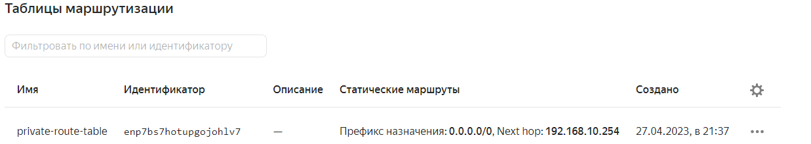

# Домашнее задание к занятию «Организация сети»

### Подготовка к выполнению задания

1. Домашнее задание состоит из обязательной части, которую нужно выполнить на провайдере Yandex Cloud, и дополнительной части в AWS (выполняется по желанию). 
2. Все домашние задания в блоке 15 связаны друг с другом и в конце представляют пример законченной инфраструктуры.  
3. Все задания нужно выполнить с помощью Terraform. Результатом выполненного домашнего задания будет код в репозитории. 
4. Перед началом работы настройте доступ к облачным ресурсам из Terraform, используя материалы прошлых лекций и домашнее задание по теме «Облачные провайдеры и синтаксис Terraform». Заранее выберите регион (в случае AWS) и зону.

```
Установка терраформ
```
https://developer.hashicorp.com/terraform/tutorials/aws-get-started/install-cli?in=terraform%2Faws-get-started
```
locadm@netology01:~$ terraform --version
Terraform v1.4.5
on linux_amd64
```
Подключение к Yandex облаку

```
locadm@netology01:~$ yc iam service-account list
+----------------------+--------------+
|          ID          |     NAME     |
+----------------------+--------------+
| aje44u6rcisgt2f1ufmu | netology     |

locadm@netology01:~$ yc config profile list
default ACTIVE

Добавил и отфиксировал провадера на Яндекс
locadm@netology01:~/git/clopro-homeworks/15.1/terraform$ terraform providers lock

locadm@netology01:~/git/clopro-homeworks/15.1/terraform$ terraform -v
Terraform v1.4.5
on linux_amd64
+ provider registry.terraform.io/yandex-cloud/yandex v0.89.0

Список типовых образов:
yc compute image list --folder-id standard-images
```

---
### Задание 1. Yandex Cloud 

**Что нужно сделать**

1. Создать пустую VPC. Выбрать зону.  
2. Публичная подсеть.

 - Создать в VPC subnet с названием public, сетью 192.168.10.0/24.
 - Создать в этой подсети NAT-инстанс, присвоив ему адрес 192.168.10.254. В качестве image_id использовать fd80mrhj8fl2oe87o4e1.
 
 - Создать в этой публичной подсети виртуалку с публичным IP, подключиться к ней и убедиться, что есть доступ к интернету.

3. Приватная подсеть.
 - Создать в VPC subnet с названием private, сетью 192.168.20.0/24.
 - Создать route table. Добавить статический маршрут, направляющий весь исходящий трафик private сети в NAT-инстанс.
 - Создать в этой приватной подсети виртуалку с внутренним IP, подключиться к ней через виртуалку, созданную ранее, и убедиться, что есть доступ к интернету.

Фаилы: 
[main.tf](terraform/main.tf)
[variables.tf](terraform/variables.tf)
[user_template.tpl](terraform/user_template.tpl)
```
В файл main.tf включил комменты, что и для чего настраивал

Финальный результат. ВМ-ки и NAT. У приватной закрыт внешний IP
locadm@netology01:~/git/clopro-homeworks/15.1/terraform$ yc compute instance list
+----------------------+--------------+---------------+---------+----------------+----------------+
|          ID          |     NAME     |    ZONE ID    | STATUS  |  EXTERNAL IP   |  INTERNAL IP   |
+----------------------+--------------+---------------+---------+----------------+----------------+
| epd7fcul3alf0v4s85eh | vm-private-1 | ru-central1-b | RUNNING |                | 192.168.20.3   |
| epdbnpfvgsd6f79mjtdm | vm-pub-1     | ru-central1-b | RUNNING | 51.250.111.113 | 192.168.10.11  |
| epdp650cae2gie555q5g | nat-instance | ru-central1-b | RUNNING | 51.250.27.121  | 192.168.10.254 |
+----------------------+--------------+---------------+---------+----------------+----------------+

Заходим на публичную машину, пингует инет
locadm@netology01:~/git/clopro-homeworks/15.1/terraform$ ssh -i ./ssh_key 51.250.111.113
Welcome to Ubuntu 20.04.6 LTS (GNU/Linux 5.4.0-147-generic x86_64)

 * Documentation:  https://help.ubuntu.com
 * Management:     https://landscape.canonical.com
 * Support:        https://ubuntu.com/advantage
New release '22.04.2 LTS' available.
Run 'do-release-upgrade' to upgrade to it.

Last login: Thu Apr 27 18:53:44 2023 from 185.234.114.41
To run a command as administrator (user "root"), use "sudo <command>".
See "man sudo_root" for details.

locadm@epdbnpfvgsd6f79mjtdm:~$ ping 8.8.8.8
PING 8.8.8.8 (8.8.8.8) 56(84) bytes of data.
64 bytes from 8.8.8.8: icmp_seq=1 ttl=61 time=21.7 ms
64 bytes from 8.8.8.8: icmp_seq=2 ttl=61 time=21.0 ms

С публичной заходим в приватную, пингуем инет

locadm@epdbnpfvgsd6f79mjtdm:~$ ssh 192.168.20.3 
Welcome to Ubuntu 20.04.6 LTS (GNU/Linux 5.4.0-147-generic x86_64)

 * Documentation:  https://help.ubuntu.com
 * Management:     https://landscape.canonical.com
 * Support:        https://ubuntu.com/advantage
New release '22.04.2 LTS' available.
Run 'do-release-upgrade' to upgrade to it.

Last login: Thu Apr 27 19:08:53 2023 from 192.168.10.11
To run a command as administrator (user "root"), use "sudo <command>".
See "man sudo_root" for details.

Доступ в инет появился на приватной машине после добавления рута на нули с нат
locadm@epd7fcul3alf0v4s85eh:~$ ping 8.8.8.8
PING 8.8.8.8 (8.8.8.8) 56(84) bytes of data.
64 bytes from 8.8.8.8: icmp_seq=1 ttl=59 time=22.9 ms
64 bytes from 8.8.8.8: icmp_seq=2 ttl=59 time=20.7 ms
64 bytes from 8.8.8.8: icmp_seq=3 ttl=59 time=20.7 ms

Инет идет через NAT.

```




Resource Terraform для Yandex Cloud:

- [VPC subnet](https://registry.terraform.io/providers/yandex-cloud/yandex/latest/docs/resources/vpc_subnet).
- [Route table](https://registry.terraform.io/providers/yandex-cloud/yandex/latest/docs/resources/vpc_route_table).
- [Compute Instance](https://registry.terraform.io/providers/yandex-cloud/yandex/latest/docs/resources/compute_instance).

---
### Задание 2. AWS* (задание со звёздочкой)

Это необязательное задание. Его выполнение не влияет на получение зачёта по домашней работе.

**Что нужно сделать**

1. Создать пустую VPC с подсетью 10.10.0.0/16.
2. Публичная подсеть.

 - Создать в VPC subnet с названием public, сетью 10.10.1.0/24.
 - Разрешить в этой subnet присвоение public IP по-умолчанию.
 - Создать Internet gateway.
 - Добавить в таблицу маршрутизации маршрут, направляющий весь исходящий трафик в Internet gateway.
 - Создать security group с разрешающими правилами на SSH и ICMP. Привязать эту security group на все, создаваемые в этом ДЗ, виртуалки.
 - Создать в этой подсети виртуалку и убедиться, что инстанс имеет публичный IP. Подключиться к ней, убедиться, что есть доступ к интернету.
 - Добавить NAT gateway в public subnet.
3. Приватная подсеть.
 - Создать в VPC subnet с названием private, сетью 10.10.2.0/24.
 - Создать отдельную таблицу маршрутизации и привязать её к private подсети.
 - Добавить Route, направляющий весь исходящий трафик private сети в NAT.
 - Создать виртуалку в приватной сети.
 - Подключиться к ней по SSH по приватному IP через виртуалку, созданную ранее в публичной подсети, и убедиться, что с виртуалки есть выход в интернет.

Resource Terraform:

1. [VPC](https://registry.terraform.io/providers/hashicorp/aws/latest/docs/resources/vpc).
1. [Subnet](https://registry.terraform.io/providers/hashicorp/aws/latest/docs/resources/subnet).
1. [Internet Gateway](https://registry.terraform.io/providers/hashicorp/aws/latest/docs/resources/internet_gateway).
